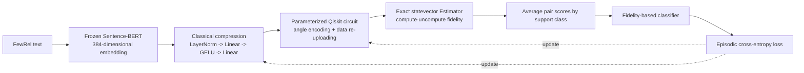

# Hybrid Classical Quantum FewRel Project Specification

## Purpose of this document

This document is the implementation specification for a new FewRel experiment based on a hybrid classical-quantum metric-learning architecture.

It is written for an implementation LLM or software engineer. It defines what the project is intended to do, how the model should be organized, how training and evaluation should work, what must be tested, and which previous design mistakes must not be repeated.

The previous exploratory implementation is located at `/Users/devaggarwal/BTP/BTP_combined/BTP_Quantum_few_rel`. The earlier PyTorch-simulator implementation is located at `/Users/devaggarwal/BTP/BTP_combined/New_Go_implementation`. The Qiskit implementation defined by this specification must live under `/Users/devaggarwal/BTP/BTP_combined/New_Plus_Qiskit_Implementation` and remain separate from both prior implementations.

## Mandatory clarification rule

Before modifying or creating implementation code, inspect the repository and compare the requested work with this specification.

If any material point is ambiguous, stop and ask the user for clarification. Do not silently choose an assumption and begin implementation.

Material ambiguities include, but are not limited to:

- whether the existing implementation should be replaced, refactored, or preserved;
- whether the new implementation should use the existing `qpn/` package or a new package;
- the target number of qubits;
- the target encoding or circuit depth;
- whether training should use exact statevector simulation or shot-based simulation (resolved here as exact Qiskit statevector simulation);
- whether QCHBA should be part of the main model or only an ablation;
- the number of training episodes, evaluation episodes, and random seeds;
- whether a final DOCX, notebook, Python package, or all three are required;
- whether the user wants a simulator-only experiment or a hardware-compatible implementation;
- any request that could change the scientific claim of the project.

The implementation may proceed only after the ambiguity has been resolved by the user.

For this implementation, the user has resolved the simulator choice: use Qiskit's exact statevector Estimator with shots disabled. PyTorch remains responsible for the classical network, loss, and optimizer integration; it must not simulate quantum gates or statevectors.

## 1. Project definition

The project studies whether a small, trainable quantum similarity space can improve or provide useful geometric behavior for few-shot relation classification on FewRel.

The project is not allowed to assume quantum advantage in advance. The main scientific question is:

> Does a trainable quantum fidelity-based metric provide useful few-shot relation classification behavior compared with a matched classical metric using the same compressed language representation?

The system should be described as a hybrid classical-quantum model:

- Sentence-BERT provides the language representation.
- A small classical network compresses the language representation.
- A trainable quantum circuit maps the compressed representation into a quantum state.
- Quantum fidelity measures similarity between a query and relation prototypes.
- Episodic training updates both the classical compression network and the quantum circuit.

The main model should not claim computational quantum speedup, quantum advantage, or quantum feature selection unless a separate experiment provides evidence for such a claim.

## 2. Approved high-level architecture

The main pipeline is:

```text
FewRel text
  -> frozen Sentence-BERT embedding
  -> small classical compression network
  -> Qiskit exact statevector simulation
  -> support/query fidelities by compute-uncompute
  -> scores equal to fidelity against empirical density-matrix prototypes
  -> episodic classification loss
  -> update classical and quantum parameters
```

The main architecture should use:

1. Frozen `all-MiniLM-L6-v2` embeddings.
2. A learned 384-to-64-to-`n_qubits` compression network.
3. Angle encoding as the initial quantum encoding.
4. Data re-uploading so that the input and trainable circuit parameters interact.
5. A shallow entangling circuit.
6. Density-matrix prototypes for multi-shot episodes.
7. The same prototype and fidelity objective during training and evaluation.
8. Episodic training on training relations and evaluation on unseen validation relations.

The first implementation should use four qubits for development and debugging. An eight-qubit configuration may be added after the four-qubit version has passed all correctness tests. PyTorch must not be used as a quantum simulator.

## 3. Main architecture flowchart



## 4. Data and NLP representation

### 4.1 FewRel data

Use the FewRel train and validation relation split.

The training relations and validation relations must remain disjoint. The validation relation labels must not be used when fitting:

- the classical compression network;
- feature scalers;
- feature selectors;
- quantum parameters;
- early-stopping decisions;
- model hyperparameters, unless a clearly documented training-validation split is used within the training relations.

### 4.2 Sentence formatting

Use a consistent sentence formatting function for both train and validation examples. Entity markers may be used, but the same marker format must be used for every split.

The implementation must record:

- the exact Sentence-BERT model name;
- whether embeddings are normalized;
- the sentence formatting rule;
- the embedding dimension;
- the number of examples and relations in each split.

### 4.3 Sentence-BERT

Use `sentence-transformers/all-MiniLM-L6-v2` as a frozen encoder for the first experiment.

The output should be a 384-dimensional vector for every sentence.

The language model should not be fine-tuned in the first implementation. Fine-tuning it would create a different and much larger experiment and should be treated as a separate study.

## 5. Small classical compression network

### 5.1 Recommended main design

Use the following compression network:

```text
384-dimensional embedding
  -> LayerNorm(384)
  -> Linear(384, 64)
  -> GELU
  -> Linear(64, n_qubits)
  -> pi * tanh
```

For four qubits:

```text
384 -> 64 -> 4
```

For eight qubits:

```text
384 -> 64 -> 8
```

The final output values are quantum rotation angles in the range approximately `[-pi, pi]`.

### 5.2 Why this layer exists

Sentence-BERT produces 384 values, but a small quantum circuit cannot efficiently process all 384 values directly.

The compression network learns a small task-specific representation that is suitable for the quantum circuit.

The compression network is trainable. It must be updated using the same episodic classification loss as the quantum circuit.

### 5.3 Required compression baselines

The implementation must support at least these two versions:

1. Linear baseline:

   ```text
   384 -> n_qubits
   ```

2. Main nonlinear version:

   ```text
   384 -> 64 -> n_qubits
   ```

The linear baseline is required to determine whether the hidden layer and GELU activation provide value.

### 5.4 Compression-layer rules

- Do not use an uncontrolled number of selected features as the quantum input.
- Do not silently mix QCHBA-selected dimensions with ANOVA-selected dimensions in the main model.
- The output dimension must equal the number of qubits for angle encoding.
- The output must be bounded before being used as a circuit angle.
- Do not use a large compression network without a documented reason.
- Do not fine-tune Sentence-BERT in the first version.
- Keep the compression layer identical for support and query examples.

## 6. Quantum encoder

### 6.1 Initial encoding

Use angle encoding for the main version.

If the compression network outputs `n_qubits` values, each value controls one qubit rotation.

Example for four qubits:

```text
[z1, z2, z3, z4]
  -> RY(z1) on qubit 1
  -> RY(z2) on qubit 2
  -> RY(z3) on qubit 3
  -> RY(z4) on qubit 4
```

### 6.2 Input-dependent trainable circuit

The quantum circuit must depend on both the compressed input and the trainable parameters.

The recommended Qiskit circuit uses `n_qubits` qubits and the following order:

```text
initial RY angle encoding of input
  -> for each trainable repetition:
       trainable RY/RZ rotations
       circular CNOT entanglement
       RY re-uploading of the input
```

This is called data re-uploading.

Every trainable block must be followed by a later input-dependent operation. The implementation must not consist only of:

```text
input encoding -> one common trainable unitary -> fidelity
```

That structure makes full-state fidelity invariant to the common unitary and prevents the trainable circuit from changing the global similarity. In particular, do not put trainable rotations after the last data re-upload: they would form a common final unitary and receive zero gradient from fidelity.

### 6.3 Circuit size

Initial default:

- four qubits;
- one or two data re-uploading repetitions;
- shallow nearest-neighbor or circular entanglement;
- RY/RZ trainable rotations.

More layers may be added only as an ablation.

The implementation must record:

- number of qubits;
- number of repetitions;
- gate types;
- entanglement pattern;
- number of trainable quantum parameters;
- whether the circuit is simulated exactly or with finite shots.

### 6.4 Qiskit simulator and differentiable fidelity

Use Qiskit's parameterized `QuantumCircuit` and exact statevector Estimator. The reference Estimator must be configured with `shots=None`; the main experiment has no sampling noise. Use `EstimatorQNN` and `TorchConnector` with `input_gradients=True` so gradients reach both the compression network and circuit inputs. The default Qiskit Machine Learning parameter-shift gradient must be checked against finite differences on the actual episodic loss.

For a query state and one support state, simulate the compute-uncompute circuit `U(s, theta)^dagger U(q, theta)` and evaluate the all-zero projector. Its exact expectation is `|<psi_s(theta)|psi_q(theta)>|^2`. For multiple support examples, average those exact pairwise fidelities within each class. This is algebraically identical to `<psi_q|rho_c|psi_q>` for the equal-weight density-matrix prototype, while avoiding a non-differentiable conversion of Qiskit statevectors into NumPy arrays.

The tested compatibility target is `qiskit>=1.1,<1.2` with `qiskit-machine-learning>=0.7.2,<0.8`, whose V1 reference Estimator is exact when `shots=None`. Do not switch silently to finite-shot sampling, a noisy backend, or a different primitive API. Any backend or major-version change requires state, fidelity, gradient, and episode-level equivalence checks before use.

## 7. Quantum prototypes

### 7.1 Support-set prototype

For relation (k), let the support states be:

```text
|psi_k1>, |psi_k2>, ..., |psi_km>
```

Use the density-matrix mixture:

```text
rho_k = (1/m) * sum_i |psi_ki><psi_ki|
```

This is a valid density matrix when the individual states are normalized. The Qiskit implementation may evaluate its query fidelity through the mathematically identical mean of exact compute-uncompute pairwise fidelities; it need not export statevectors or materialize the matrix in PyTorch.

### 7.2 One-shot episodes

In a 5-way 1-shot episode, each relation has one support example. Therefore:

```text
rho_k = |psi_k><psi_k|
```

The prototype is simply the one support state.

### 7.3 Multi-shot episodes

In a 5-way 5-shot episode, each relation has five support examples. The density-matrix mixture represents all five support states.

Multi-shot experiments are important because they actually test the mixed-state prototype idea.

### 7.4 Prototype claims

The documentation may describe the mixture as:

- a natural representation of the support-set distribution;
- a valid mixed-state prototype;
- a prototype that makes average pure-state fidelity computable.

The documentation must not claim that the mixture is automatically the fidelity-optimal or Bregman-optimal prototype without a separate mathematical proof.

## 8. Fidelity classifier

For each query state and relation prototype, calculate quantum state fidelity.

Fidelity is a similarity score between zero and one:

- one means identical states;
- zero means completely different states;
- larger values mean greater similarity.

For a pure query and a mixed prototype:

```text
F(|q>, rho_k) = <q|rho_k|q>
```

In the Qiskit implementation, calculate the same score as the mean support/query pure-state fidelity. Do not replace the exact all-zero probability with sampled measurement counts.

The predicted class is the relation with the highest fidelity.

### 8.1 Logit scaling

The fidelity values may be multiplied by a positive scale parameter beta before the softmax.

Beta must be positive. It may be implemented using a softplus transformation:

```text
beta = softplus(raw_beta) + epsilon
```

The implementation must not allow beta to become negative without an explicit scientific reason.

### 8.2 Train/evaluation consistency

Training and evaluation must use the same prototype objective.

Preferred initial rule:

- create the density-matrix prototype during both training and evaluation;
- calculate query-to-prototype fidelity during both training and evaluation;
- use the resulting fidelity values for classification loss and prediction.

Do not train using one prototype objective and evaluate using a different objective.

## 9. Five-way one-shot training episode

### 9.1 Episode construction

Sample five training relations:

```text
Relation A
Relation B
Relation C
Relation D
Relation E
```

Sample:

- one support example per relation;
- fifteen query examples per relation.

The episode contains:

- five support examples;
- 75 query examples.

### 9.2 Support processing

Each support sentence passes through:

```text
Sentence
  -> Sentence-BERT
  -> compression network
  -> quantum encoder
  -> support quantum state
```

The five support states become the five relation prototypes.

### 9.3 Query processing

Each query sentence passes through the same compression network and quantum encoder.

The support and query paths must share model parameters, but each input must produce its own input-dependent quantum state.

### 9.4 Classification

For each of the 75 queries:

1. calculate fidelity with prototype A;
2. calculate fidelity with prototype B;
3. calculate fidelity with prototype C;
4. calculate fidelity with prototype D;
5. calculate fidelity with prototype E;
6. choose the highest score.

Each query therefore produces five class scores.

### 9.5 Loss and update

Compare the predicted scores with the true query relation labels using cross-entropy loss.

Use the loss to update:

- the weights and biases of the compression network;
- the trainable quantum gate parameters;
- the positive fidelity scale beta, if beta is learnable.

Repeat this process for many episodes.

### 9.6 Episode counts

`5w1s` describes the structure of one episode. It does not specify the total number of episodes.

One 5-way 1-shot episode contains:

- five relation classes;
- one support example per relation, giving five support examples;
- fifteen query examples per relation, giving 75 query examples;
- 80 total examples.

```text
5-way 1-shot episode
  = 5 support examples + 75 query examples
  = 80 total examples
```

The total number of episodes must be a configurable experiment setting:

```text
n_train_episodes = configurable
n_validation_episodes = configurable
```

Recommended starting values are:

| Experiment stage | Training episodes | Validation episodes | Purpose |
|---|---:|---:|---|
| Development/debugging | 10–20 | 10–20 | Confirm that the pipeline runs and gradients behave correctly |
| Pilot experiment | 100–200 | 100–200 | Identify unstable settings and compare early architecture choices |
| Final experiment | 600 | 600 | Produce the main reported result for each seed |

These are recommendations, not fixed scientific conclusions. The final episode counts must be confirmed before implementation if they affect runtime, compute budget, or the planned comparison.

## 10. Gradient and optimization rules

The classical compression network may use ordinary automatic differentiation.

The quantum circuit must be simulated by Qiskit. Use Qiskit Machine Learning's differentiable estimator integration (`EstimatorQNN` plus `TorchConnector`) with `input_gradients=True` and the parameter-shift gradient, or another Qiskit-supported differentiable method that is explicitly tested against finite differences. PyTorch autograd is used to connect gradients through the classical compression network; PyTorch must not implement quantum gate evolution or statevector simulation.

Before large experiments, the implementation must verify that:

- changing a quantum parameter changes the output similarity;
- the calculated gradient matches a finite-difference gradient;
- the gradient is not only a floating-point numerical residue;
- the classical compression parameters receive nonzero gradients;
- the quantum parameters receive nonzero gradients when expected.

The implementation must not declare the quantum circuit trainable merely because `loss.backward()` runs without an exception.

## 11. QCHBA policy

QCHBA should not be part of the main trainable architecture in the first implementation.

The main model should use learned classical compression.

QCHBA may be used in separate experiments as:

- a feature-selection baseline;
- an optional preprocessing comparison;
- a study of classical versus quantum-inspired selection.

QCHBA must be described as quantum-inspired and classical unless actual quantum hardware or quantum simulation is used in its operation.

The following claims are not allowed without new evidence:

- QCHBA and the quantum circuit are jointly optimized;
- QCHBA is trained by the QProtoNet loss;
- QCHBA performs quantum feature selection;
- QCHBA selects exactly `n_features` unless the implementation explicitly enforces this.

## 12. Required project structure

The implementation should separate reusable code from notebooks and experiment scripts.

For this implementation, the user confirmed exact Qiskit statevector
simulation. The Qiskit reference Estimator runs parameterized circuits exactly
with shots disabled. The `TorchConnector` carries the Qiskit Machine Learning
gradients into the classical PyTorch network; PyTorch is not the quantum
simulator. The implementation is not a claim about quantum-hardware runtime or
hardware noise.

Recommended structure:

```text
New_Plus_Qiskit_Implementation/
├── qpn_hybrid/
│   ├── __init__.py
│   ├── config.py
│   ├── data.py
│   ├── embeddings.py
│   ├── episodes.py
│   ├── compression.py
│   ├── quantum_encoder.py
│   ├── prototypes.py
│   ├── fidelity.py
│   ├── model.py
│   ├── training.py
│   ├── evaluation.py
│   ├── baselines.py
│   └── metrics.py
│
├── experiments/
│   ├── train_main.py
│   ├── evaluate_main.py
│   ├── run_ablation.py
│   └── run_multi_seed.py
│
├── notebooks/
│   ├── 01_data_exploration.ipynb
│   ├── 02_single_episode.ipynb
│   ├── 03_training_debug.ipynb
│   └── 04_results_analysis.ipynb
│
├── tests/
│   ├── test_data.py
│   ├── test_episodes.py
│   ├── test_compression.py
│   ├── test_quantum_encoder.py
│   ├── test_prototypes.py
│   ├── test_fidelity.py
│   ├── test_gradients.py
│   └── test_benchmark_protocol.py
│
├── configs/
│   ├── four_qubit.yaml
│   └── eight_qubit.yaml
│
├── data/
├── results/
├── requirements.txt
└── PROJECT_IMPLEMENTATION_SPEC.md
```

The new implementation package is `qpn_hybrid/` inside `New_Plus_Qiskit_Implementation/`.

Neither prior implementation may be overwritten or used as the default implementation for this project. The Qiskit package must use the existing embedding caches only as data inputs, with their provenance recorded; it must not import simulator code from either prior package.

## 13. Baseline and fairness requirements

Every main comparison must state exactly what input the model receives.

The main fair comparison should use the same compressed vectors for all models:

```text
Sentence-BERT
  -> same classical compression network
  -> same n-dimensional vector
```

Then compare:

1. Classical Euclidean ProtoNet.
2. Classical cosine ProtoNet.
3. Fixed quantum feature map with fidelity.
4. Trainable quantum encoder with fidelity.
5. Linear compression versus nonlinear compression.

The benchmark must include a trained classical ProtoNet. An untrained nearest-centroid classifier may be included, but it must not be the only classical ProtoNet comparison.

For every model, record:

- input dimension;
- trainable parameter count;
- training episodes;
- optimizer and learning rate;
- evaluation episodes;
- random seed;
- runtime;
- whether the model is trained globally, episodically, or only fitted inside each episode.

## 14. Evaluation protocol

### 14.1 Common evaluation episodes

Generate one fixed list of validation episodes per setting and reuse that exact list for every model.

This is required for meaningful paired comparisons.

### 14.2 Multiple seeds

Run multiple independent seeds. A single seed is not sufficient for the main scientific conclusion.

Report:

- mean accuracy;
- standard deviation across seeds;
- confidence interval across episodes or seeds, clearly labeled;
- weighted F1 if required;
- per-setting results.

### 14.3 Model initialization

Decide explicitly between:

1. one model trained once and evaluated at multiple shot settings; or
2. one freshly initialized model per setting.

Do not accidentally reuse a model across settings.

### 14.4 No validation leakage

Validation relations may be used for final evaluation and reporting only.

Do not use validation accuracy to choose:

- compression size;
- qubit count;
- circuit depth;
- optimizer settings;
- encoding type;
- stopping point.

If model selection is required, split the training relations into training and development relation sets.

## 15. Required tests

The tests must verify mathematical behavior, not only that functions run.

### Data tests

- train and validation relation sets are disjoint;
- Sentence-BERT outputs have the expected dimension;
- support and query examples do not overlap inside an episode;
- labels and features remain aligned.

### Compression tests

- output dimension equals `n_qubits`;
- final angles are bounded;
- linear and nonlinear modes produce valid tensors;
- support and query use the same parameters.

### Quantum state tests

- Qiskit's exact Estimator with `shots=None` agrees with a direct Qiskit `Statevector` reference;
- compute-uncompute scores agree with direct statevector overlap for one-shot and multi-shot support sets;
- fidelity lies between zero and one within numerical tolerance;
- the tested circuits contain no measurements or noise model.

### Objective tests

- train-time and evaluation-time prototype scores agree on the same data;
- global average pairwise fidelity equals fidelity against the global mixture;
- local and global objectives are explicitly distinguished;
- no common final unitary-only circuit is used for trainable global fidelity.

### Gradient tests

- quantum gradients are compared with finite differences;
- gradients are tested away from zero initialization as well as at initialization;
- the test rejects numerical residues such as `1e-16` as meaningful gradients;
- both compression and quantum parameters receive gradients.
- parameter-shift gradients of the actual episodic cross-entropy agree with finite differences for input angles and every trainable circuit repetition.

### Benchmark tests

- all models receive the intended input dimension;
- all models are evaluated on the same episode list;
- model state is not accidentally carried across independent settings;
- results include the seed and configuration.

## 16. Required ablations

The first ablation plan should include:

### Compression ablations

- direct linear compression: 384 to qubits;
- nonlinear compression: 384 to 64 to qubits;
- no learned compression, using a fixed classical reduction.

### Quantum ablations

- fixed quantum circuit versus trainable quantum circuit;
- angle encoding versus ZZ encoding;
- one versus two data re-uploading repetitions;
- four versus eight qubits;
- different entanglement patterns if computationally feasible.

### Prototype ablations

- one-shot pure prototypes;
- density-matrix mixtures;
- average pairwise fidelity;
- Bures or trace-distance comparisons if implemented correctly.

### Feature-selection ablations

- learned compression;
- ANOVA selection;
- QCHBA selection;
- no feature selection beyond the learned projection.

## 17. Performance and implementation rules

- Start with four qubits.
- Use shallow circuits first.
- Run a single episode before long training.
- Cache Sentence-BERT embeddings.
- Save configuration files with every result.
- Save model checkpoints during long runs.
- Record runtime separately for embedding, preprocessing, training, evaluation, and quantum simulation.
- Do not describe statevector simulation time as quantum hardware runtime.
- Do not claim hardware compatibility unless the circuit and gradient procedure are actually compatible with the target backend.
- Keep notebooks for exploration and visualization; keep reusable model code in Python modules.

## 18. Scientific claims policy

The project may claim:

- a hybrid classical-quantum metric-learning architecture;
- a trainable quantum feature space;
- fidelity-based relation classification;
- density-matrix support prototypes;
- an empirical comparison between classical and quantum similarity spaces.

The project must not claim without additional evidence:

- quantum computational speedup;
- quantum predictive advantage;
- automatic fidelity-optimality of the density-matrix mixture;
- a Bregman-divergence theorem for fidelity;
- quantum feature selection by QCHBA;
- joint QCHBA and VQC optimization;
- meaningful VQC training if the circuit is only a common final unitary.

## 19. Implementation workflow

Implementation should proceed in this order:

1. Confirm all ambiguous decisions with the user.
2. Inspect the existing repository without changing it.
3. Create the new package or branch agreed with the user.
4. Implement data loading and episode tests.
5. Implement and test the compression network.
6. Implement the parameterized Qiskit circuit and exact compute-uncompute EstimatorQNN.
7. Verify one support/query fidelity against direct Qiskit Statevector overlap.
8. Verify one 5-way 1-shot episode manually.
9. Verify gradients against finite differences.
10. Implement the training loop.
11. Implement fixed validation episodes.
12. Add the trained classical baselines.
13. Run the small four-qubit experiment.
14. Run ablations and multiple seeds.
15. Only then consider eight qubits, alternative encodings, or QCHBA experiments.

At every stage, stop and ask the user if the next implementation decision is not determined by this specification.

## 20. Definition of success

The implementation is ready for the main experiment only when:

- the compression layer produces the intended number of quantum inputs;
- the quantum fidelity changes when every trainable circuit repetition changes;
- quantum gradients agree with finite differences;
- training and evaluation use the same prototype objective;
- train and validation relations are separated;
- all models use a declared and fair input protocol;
- the trained classical ProtoNet is included;
- all models use common evaluation episodes;
- multiple seeds are reported;
- results can be reproduced from saved configuration files;
- the final claims match what the experiment actually tests.

The final research conclusion should be based on the comparison between the matched classical metric and the matched quantum fidelity metric, not on raw comparisons between models with different input dimensions or training procedures.
